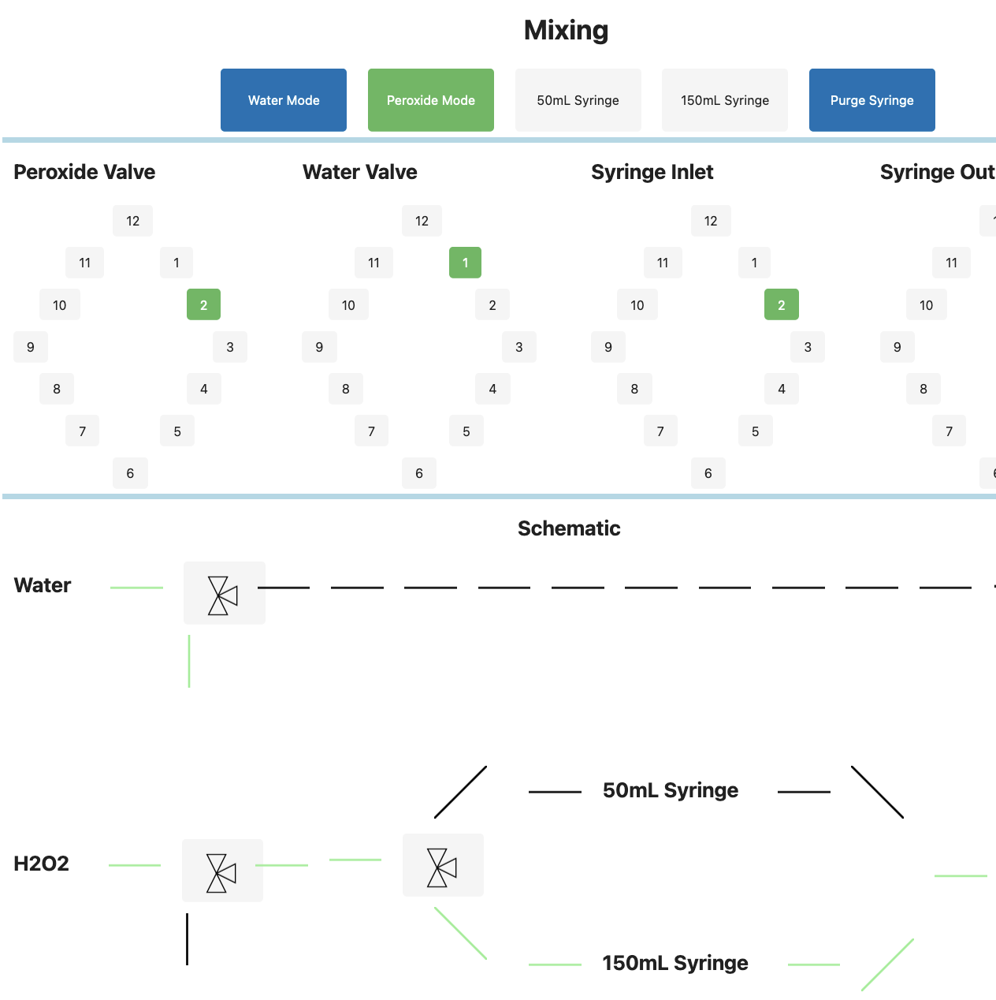
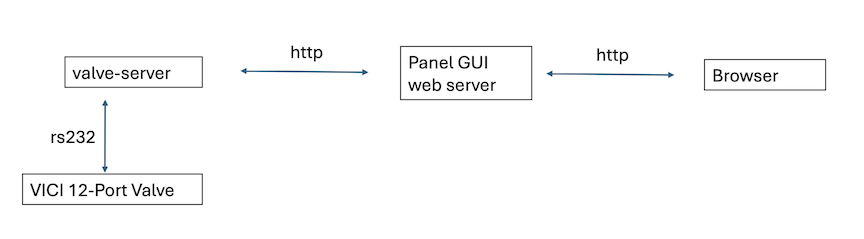
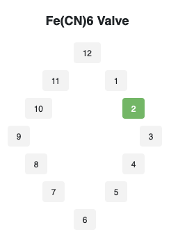
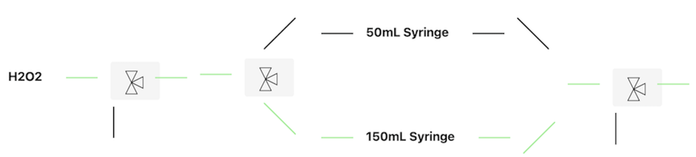
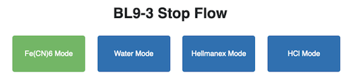

# vici-valve-app 

Python app to control VICI 12-port valves and build web-based GUIs (w/ [Panel](https://panel.holoviz.org/)).

File valve-frontend/stopflow.py is an example GUI application.

For flexibility, the serial interface to the VICI (valve-server/) is run separate from the frontend GUI (valve-frontend/).  The two communicate via http (using Tornado).  This way you could choose to run the serial interface on something lightweight like a raspberry pi for example and put the heavier GUI process on a separate machine.

There are UI elements for drawing the 12-port valve itself, 

or you could get fancy and draw an interactive schematic with representational 2-way or 3-way valves and link them together with tubing lines.

It's also straightforward to create high level button widgets to do multiple things at once, ie switch multiple VICI valves to change between sample modes.

---
### valve-frontend/ and valve-server/ have readme's to describe how to get them running. 
